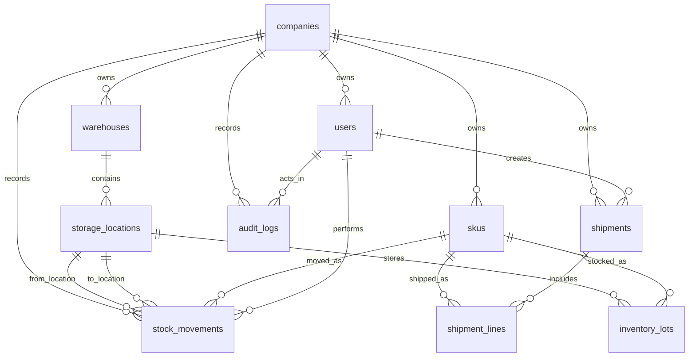

# Inventrack PostgreSQL Relationship Map

This guide explains how the enterprise PostgreSQL practice schema connects. Use it as a quick ERD companion when writing joins, backend queries, migrations, or API endpoints.

## High-level relationship diagram



## Tenant ownership paths

Inventrack is multi-tenant. Most operational queries should start from `companies` or include a `company_id` filter so one company's inventory never leaks into another company's result set.

Direct tenant-owned tables:

- `users.company_id -> companies.id`
- `warehouses.company_id -> companies.id`
- `skus.company_id -> companies.id`
- `shipments.company_id -> companies.id`
- `stock_movements.company_id -> companies.id`
- `audit_logs.company_id -> companies.id`

Indirect tenant-owned tables:

- `storage_locations -> warehouses -> companies`
- `inventory_lots -> skus -> companies`
- `inventory_lots -> storage_locations -> warehouses -> companies`
- `shipment_lines -> shipments -> companies`
- `shipment_lines -> skus -> companies`

Important integrity rule: indirect paths should agree. For example, an `inventory_lot` should reference a SKU and location that belong to the same company.

## Core join paths

### Current inventory by warehouse/location

```text
companies
  -> warehouses
  -> storage_locations
  -> inventory_lots
  -> skus
```

Use this for inventory screens, location detail pages, and warehouse availability reports.

### Low-stock dashboard

```text
companies
  -> skus
  -> inventory_lots
```

Group by SKU, sum `quantity_on_hand - quantity_reserved`, then compare available stock to `skus.reorder_point`.

### Shipment detail

```text
companies
  -> shipments
  -> shipment_lines
  -> skus
```

Use this for inbound receiving and outbound export workflows.

### Stock movement history

```text
companies
  -> stock_movements
  -> skus
  -> users
  -> storage_locations as from_location
  -> storage_locations as to_location
```

Use left joins for `from_location_id`, `to_location_id`, and `performed_by_user_id` because some movement types intentionally leave one side blank.

### Audit history

```text
companies
  -> audit_logs
  -> users as actor
```

Use this for compliance, debugging, and admin review screens.

## Movement type location rules

The stock movement ledger should remain append-only. Application code updates stock balances and inserts matching movement records in the same transaction.

| Movement type | Expected source | Expected destination | Notes |
| --- | --- | --- | --- |
| `receive` | `NULL` | storage/staging location | Adds inventory from outside the system. |
| `export` | storage location | `NULL` | Removes inventory from the system. |
| `move` | storage location | storage location | Moves inventory between locations. |
| `adjust` | optional | optional | Corrects a counted balance; notes should explain why. |
| `reserve` | storage location | same or blank by implementation | Increases reserved quantity for future export. |
| `release_reservation` | storage location | same or blank by implementation | Decreases reserved quantity. |
| `return` | `NULL` or customer reference | storage location | Brings stock back into inventory. |
| `cycle_count` | storage location | storage location or blank | Records a physical count reconciliation. |

## API design notes

Good API handlers should preserve these database relationships:

- Always scope reads by company/tenant.
- Validate that referenced SKUs, locations, shipments, and users belong to the same company.
- Wrap stock balance updates and `stock_movements` inserts in one transaction.
- Prefer read models/views for dashboard screens instead of duplicating complex joins in frontend code.
- Keep `stock_movements` append-only; do not edit historical movement rows to fix inventory.

## Practice prompts

1. Draw the join path for a warehouse detail page showing each bin and current SKU quantity.
2. Write a query that finds inventory lots where the SKU company differs from the location's warehouse company. It should return zero rows.
3. Write a query that shows shipment lines with shipment status, SKU name, ordered quantity, received quantity, and exported quantity.
4. Write a query that lists every stock movement with human-readable source and destination location codes.
5. Explain why `inventory_lots` does not store `company_id` directly even though inventory is tenant-owned.
